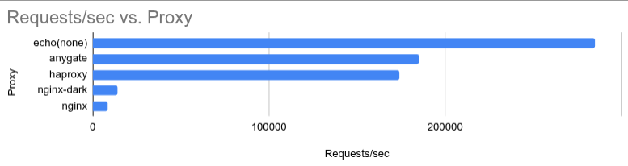
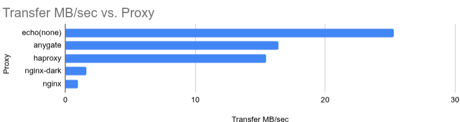
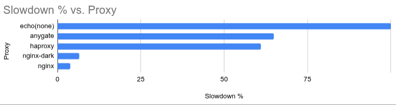

# 🌐 AnyGate — Твой Бро в мире Прокси


AnyGate — это как тот самый друг, который всегда под рукой, быстрый как молния, и решает все проблемы как настоящий профи. Хочешь, чтобы всё работало как часы? Погнали, AnyGate вытащит твои маршруты и middlewares за секунды, с минимальными усилиями и максимальной отдачей.

## 🔥 Почему тебе нужен AnyGate?
- ⚡ Производительность на максималках: Забудь о задержках. Этот монстр настроен на скорость.
- 🚀 Гибкость: Хочешь подключить плагины? Легко. Настроить маршруты? Без проблем. Всё под твою задачу.
- 🪄 Минимализм на грани искусства: Настраиваешь лишь то что нужно, запускаешь — и получаешь результат.
- 🧙 Плагины: Давай жару! Rate limiting, Zero Logging, JWT Auth, Mod Headers — подключай что хочешь.

## 🧾 Пример конфигурации
Вот как выглядит твой новый конфиг, бро. Все в порядке? Погнали:

```yaml
# Основная карта маршрутов
routes:
  /api/users/: http://users-backend:8081/api/ # Простая маршрутизация URL -> backend
  GET POST /api/entity: https://e.com/api/ent # Прокси только выбранных методов
  /: /dist/                                   # Статическая маршрутизация для твоего SPA

# Настройки прокси сервера
proxy:
  timeout: 30s  # Timeout — когда всё работает быстро, но ты не ждешь

# Настройки статик сервера
static:
  compress: true                              # Включить сжатие, может помочь при слабом bandwidth
  skip_cache: true                            # Отключить кеш file handler'ов, например для дева

# Плагины - миддлвары, которые вешаюся на хендлер
plugins:
  - kind: rate_limiter  # Это твой любимый друг, чтобы не перегрузить систему
    args:
      rate: 1000  # Сколько запросов можно за секунду?
      burst: 1000  # Резерв, когда надо — оторвёмся по полной
```

[Узнать подробнее](CONFIG.md)

## ⚙️ Как это работает?
Здесь всё просто, как щелчок пальцем Таноса — и мир превращается в порядок:
- 🎯 Маршруты:
  - Твоя API — твои правила. Маршруты режутся чётко, как ножом по стеклу.
  - Направляй трафик как хочешь — ты в кресле пилота.
- 🧩 Плагины:
  - Rate limit, CORS, логгинг, заголовки — всё на месте.
  - Хочешь больше — напиши свой плагин и встрой его в цепочку.
- 🧱 Группы:
  - Разделяй и властвуй.
  - Наследуй конфиг и плагины, строй древовидную иерархию, как будто ты архитектор прокси-матрицы.

## 🛠️ Установка
Легко. Без заморочек. Просто запусти:

```bash
# Забираешь реп
git clone https://github.com/xakepp35/anygate.git
cd anygate

# Собираешь проект
go build -o anygate cmd/app/main.go

# Запускаешь сервак
./anygate anygate.example.yml
```

или

## ✅ Это просто работает
AnyGate — твой бро в мире прокси. Всё, что тебе нужно для настройки маршрутов, плагинов и всего, что с этим связано. Меньше времени на конфигурации — больше на то, чтобы разрывать всё на скорости.

## ⚡ Прожарка прокси







## 🤝 Контрибьюты
Думаешь, можешь сделать ещё круче? Не стесняйся - Залетай. Присылай PR. Мы всегда рады новым идеям!

```
          _                 ____       _       
         / \   _ __  _   _ / ___| __ _| |_ ___ 
        / _ \ | '_ \| | | | |  _ / _` | __/ _ \
       / ___ \| | | | |_| | |_| | (_| | ||  __/
      /_/   \_\_| |_|\__, |\____|\__,_|\__\___|
                     |___/                     
                     by AnyKey
🔥 HYPER-FLEXIBLE. ZERO BULLSH*T. GO FAST OR GO HOME. 🔥
```
